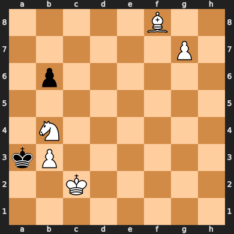

# Chess Experiments with Python

## Exercise 1

White to move and mate in 3.

### fen

"5B2/6P1/1p6/8/1N6/kP6/2K5/8 w - - 0 1"

### Analysis in Lichess:

https://lichess.org/analysis/standard/5B2/6P1/1p6/8/1N6/kP6/2K5/8_w_-_-_0_1

## Test

